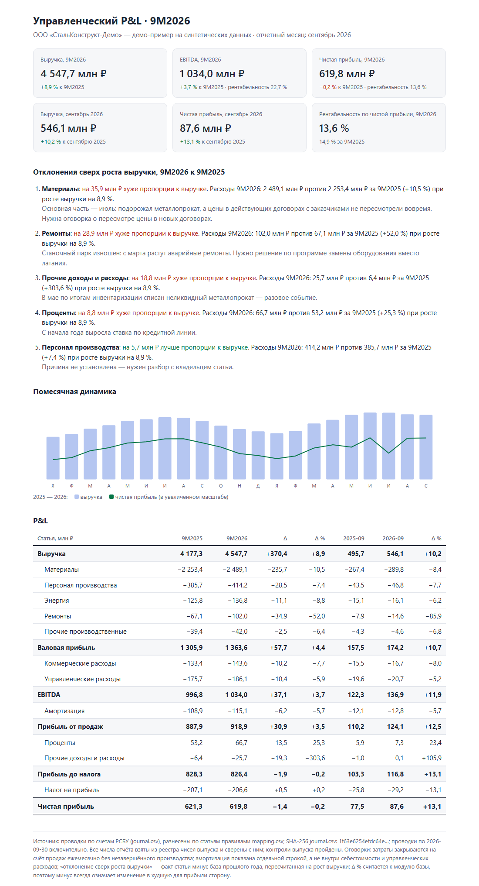

# Управленческая отчётность с AI-агентом и слепой проверкой

[](https://github.com/till2718281828/ai-management-reporting/actions/workflows/ci.yml)

**[Открыть отчёт →](https://till2718281828.github.io/ai-management-reporting/)** · [Протокол проверки агентом](docs/agent-run.md) · [Методика](docs/methodology.md) · [English](#english)

Демо на синтетических данных: из главной книги вымышленного завода собирается управленческий P&L
для руководителя — одностраничный отчёт и Excel-книга. Каждое число проходит контроли расчёта, реестр
чисел и независимый пересчёт; AI-агент провёл ту же проверку вслепую — протокол приложен.

Автор — финансовый директор; механика взята из его работы (см. [«Из практики»](#из-практики)).



## Зачем

AI ускоряет подготовку отчётности. Но руководителю нужен не быстрый отчёт, а верный: одно неверное
число в отчёте наверх стоит доверия ко всем остальным. Поэтому здесь скорость агента уравновешена тем
же, чем финансовая служба страхует людей, — регламентом, сверками и проверкой «второй парой глаз».

**Результат проверки агентом.** В готовый отчёт намеренно внесли одну ошибку: в карточке «Чистая
прибыль, 9 месяцев» 629,8 млн ₽ вместо 619,8. Агент не знал, что и где искажено, и не видел кода
расчёта. Он пересчитал всё сам из проводок, нашёл именно эту карточку и подтвердил все 495 строк
реестра и остальные 157 чисел отчёта — [протокол как есть](docs/agent-run.md).

## Как устроено


Три рубежа:

1. **Контроли расчёта.** Управленческий P&L (затраты по элементам) и бухгалтерский (со счетов 90/91/99)
   строятся двумя путями и должны совпасть до копейки; прибыль сверяется с главной книгой; затратные
   счета закрыты; каждая проводка разнесена. Любая ошибка останавливает выпуск.
2. **Реестр чисел.** Число попадает в отчёт только из реестра, а в реестр — только из расчёта. Каждое
   число в отчёте привязано к своей строке реестра; число без привязки или с потерянным знаком — ошибка.
3. **Слепая проверка.** Скрипт [`verifier/`](verifier/recompute.py) пересчитывает всё из исходников по
   [методике](docs/methodology.md) другим способом — тест запрещает ему использовать код расчёта.
   Агент [`blind-verifier`](.claude/agents/blind-verifier.md) делает то же своим кодом, не открывая
   ни расчёт, ни скрипт проверки.

## Где решает человек

| Делает агент | Решает человек |
|---|---|
| Собирает P&L, реестр, отчёт и Excel | Методика: что считать и как показывать |
| Проверяет контроли и привязку чисел | Причины отклонений — их даёт владелец статьи, агент не придумывает |
| Формулирует текст отклонений по полученным причинам | Подходит ли каждое число своему месту и понятна ли фраза — по [чек-листу](.claude/skills/management-report/checklist.md) |
| Пересчитывает выпуск вслепую и пишет протокол | Отправка наверх — только после явного «ок» |

## Из практики

Механика взята из моей работы финансовым директором группы компаний; здесь она переписана на
вымышленных данных:

- регулярный обзор для собственника, где каждое число проходит через реестр и сверяется скриптом;
- слепой проверяющий-агент на ежемесячных управленческих выпусках;
- фактический P&L из хранилища данных с инвариантом «управленческий учёт = бухгалтерский» и сверкой
  с главной книгой;
- замечания рецензентов к отчёту разбираются с LLM и становятся правилами чек-листа следующего выпуска.

Этот репозиторий собран вместе с Claude Code по тому же циклу: план, разбор решений, исполнение по
шагам, независимое ревью каждого шага, журнал решений. Моя часть — постановка, методика, решения и приёмка.

## Попробуйте сломать

```bash
python -m pipeline.run --inject-error   # в готовый отчёт вносится одно неверное число
python -m verifier.recompute            # проверка его находит и падает: «расхождений: 1»
```

Так выглядит ручная правка «на глаз» перед отправкой: расчёт её не видит, слепая проверка — видит.
Сценарий прогоняется на каждом коммите в CI.

## Запуск

```bash
python -m venv .venv && source .venv/bin/activate   # Windows: .venv\Scripts\activate
pip install -r requirements.txt
python -m pipeline.run          # выпуск в output/: index.html, report.xlsx, registry.csv, controls.md
python -m verifier.recompute    # слепая проверка: output/verification.md
python -m pytest -q             # тесты; пересчёт Excel — если установлен LibreOffice
```

Ключ API не нужен. Проверка агентом — в Claude Code: агент `blind-verifier` из папки `.claude/`.
Данные пересоздаются командой `python -m generator.generate`.

## Что внутри

| Путь | Что |
|---|---|
| `data/` | синтетика: проводки, план счетов, правила разноски, причины отклонений; [описание компании](data/company.md) |
| `pipeline/` | расчёт: манифест исходников, P&L на DuckDB, контроли, реестр, отчёт HTML и Excel |
| `verifier/` | независимый пересчёт и протокол |
| `docs/methodology.md` | методика — договорённость между расчётом и проверкой |
| `.claude/` | агент слепой проверки и скилл выпуска с чек-листом приёмки для Claude Code |
| `tests/` | ручной расчёт на маленькой книге, отрицательные случаи контролей, пересчёт Excel, независимость проверки |

## Ограничения

- Данные синтетические, одно юрлицо, без незавершённого производства; балансовые счета ведутся
  упрощённо — баланс и движение денег не строятся.
- Ошибку в самих правилах разноски (статья разнесена не туда) не увидят ни расчёт, ни проверка —
  она ловится только сверкой с бухгалтерией по итогам и глазами владельца статьи.
- «Отклонение сверх роста выручки» для постоянных и финансовых статей — условная мера; см. методику.

---

## English

**Management reporting with an AI agent and a blind check.** A demo on synthetic data: a fictional
plant's general ledger (Russian GAAP accounts) is turned into a one-page management P&L and a
formula-driven Excel workbook. Every number passes three gates: calculation controls (management P&L
equals statutory P&L to the kopeck and ties to the ledger), a number registry (each figure in the report
is bound to its registry row), and a blind check — an independent recomputation plus a Claude Code agent
with no access to the calculation code.

**Result.** One wrong number was planted in the finished report (net profit 629.8 instead of 619.8 RUB m).
The agent was not told what or where; it recomputed everything from the ledger, found exactly that
figure and confirmed all 495 registry rows and the other 157 report numbers ([protocol](docs/agent-run.md)).
People own the methodology, the causes of variances, the acceptance checklist and the decision to send.

The mechanics come from my work as CFO of a group of companies, rewritten on fictional data.

---

Автор — Владимир Лобанов, финансовый директор. Лицензия MIT.
